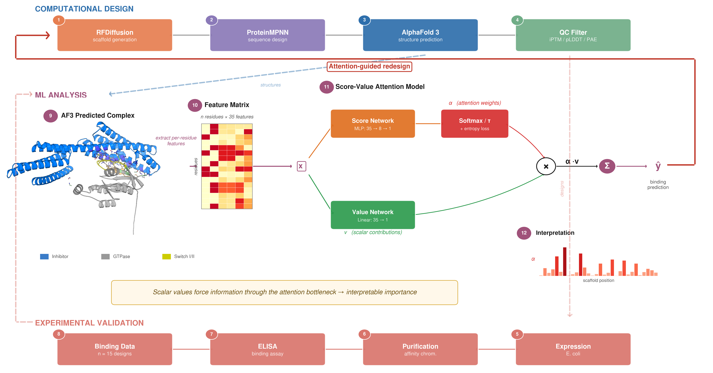
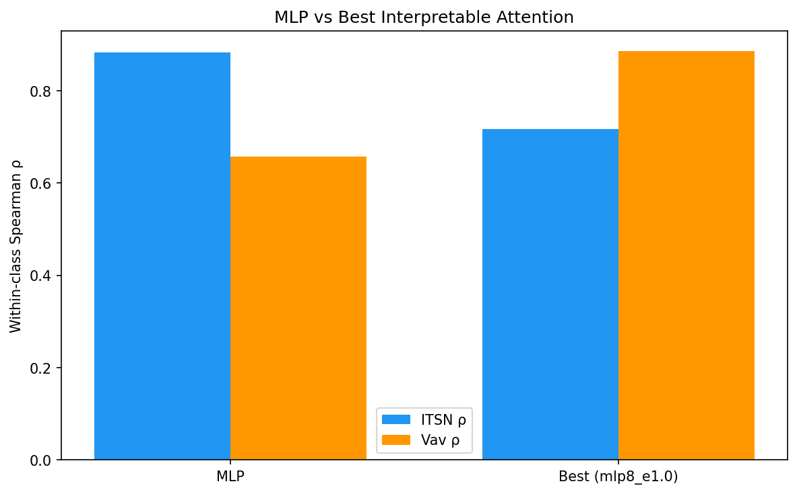
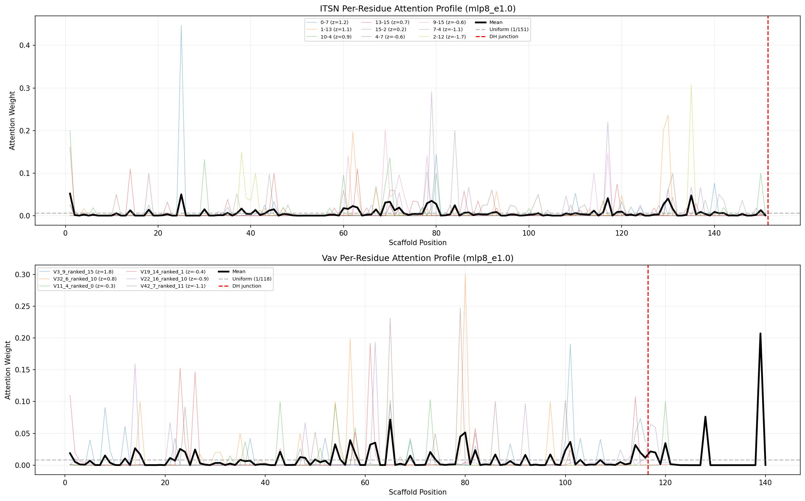
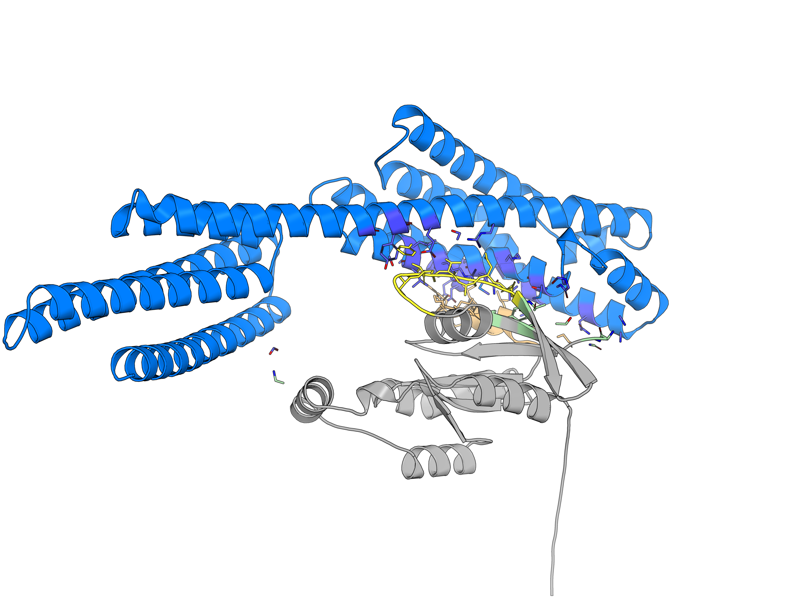

# GEF Inhibition: Structure-Guided Analysis of Computationally Designed GEF Inhibitors

Computational and experimental pipeline for analyzing protein-protein interactions between designed GEF (Guanine nucleotide Exchange Factor) inhibitors and their target GTPases. Uses AlphaFold 3 predicted structures and a score-value attention model to identify residue-level determinants of binding affinity.



## Overview

GEF proteins activate small GTPases (Cdc42, Rac1) by catalyzing GDP-to-GTP exchange. This project analyzes **15 computationally designed inhibitors** — 9 targeting the ITSN/Cdc42 interface and 6 targeting the Vav/Rac1 interface — that block GEF-GTPase interactions through competitive binding at the DH domain.

### Key Results

- **Score-value attention model** achieves R² = 0.756 (leave-one-out CV) on binding affinity prediction from per-residue structural features
- Attention weights identify scaffold positions that differentiate strong vs. weak binders
- Hotspot residues (known conserved DH contacts) receive low attention, confirming the model learns discriminative rather than conserved features
- All AF3 models pass quality control (iPTM 0.85–0.89, no steric clashes)

## Pipeline

```
 1. RFDiffusion          Scaffold generation (de novo backbone design)
 2. ProteinMPNN          Sequence design (fixed backbone → amino acid sequence)
 3. AlphaFold 3          Structure prediction (inhibitor–GTPase complex)
 4. QC Filter            Model quality assessment (iPTM / pLDDT / PAE)
 5. Expression           Recombinant expression in E. coli
 6. Purification         Affinity chromatography
 7. ELISA                Binding affinity measurement
 8. Binding Data         Quantified binding for 15 designs
 9. Structure Parsing    Extract AF3 predicted complex coordinates
10. Feature Extraction   Per-residue structural features (35 dimensions)
11. Attention Model      Score-value decomposition with entropy regularization
12. Interpretation       Attention-weighted residue importance maps
```

## Results

### Model Performance

Leave-one-out cross-validation comparing the score-value attention model against a linear baseline:




### Attention Analysis

Per-residue attention profiles reveal which scaffold positions drive binding affinity predictions. High-attention residues cluster in variable scaffold regions rather than the conserved DH domain:



### Structure Visualization

AF3 predicted complex of the best-binding ITSN design (RFD1_0-7) with Cdc42. Inhibitor scaffold (blue), GTPase (gray), switch regions (yellow/orange):



## Model Architecture

Score-value attention with entropy regularization:

```
                    ┌─ Score Network (MLP: 35→8→1) ─→ Softmax/τ ─→ αᵢ ─┐
 xᵢ (features) ────┤                                                    ├─→ Σ(αᵢ·vᵢ) ─→ ŷ
                    └─ Value Network (Linear: 35→1) ─────────────────→ vᵢ ─┘
```

- **Score branch**: learns which residues to attend to (MLP with hidden layer)
- **Value branch**: learns per-residue binding contributions (single linear layer)
- **Temperature-scaled softmax**: controls attention sharpness
- **Entropy regularization**: prevents attention collapse to single residue
- Scalar values force information through the attention bottleneck, making weights directly interpretable as residue importance

## Project Structure

```
GEF_inhibition/
├── src/                          # Analysis modules
│   ├── structure_qc.py           # Phase 1: AF3 output QC & model selection
│   ├── contact_extraction.py     # Phase 2: Inter-chain contact computation
│   ├── feature_engineering.py    # Phase 3: SASA, DSSP, electrostatics
│   ├── network_analysis.py       # Phase 4: Residue interaction graph features
│   ├── per_residue_features.py   # Per-residue feature extraction
│   ├── per_residue_analysis.py   # Score-value attention model & analysis
│   ├── model.py                  # ContactAttentionModel (PyTorch)
│   ├── train.py                  # Phase 5: LOO-CV training
│   ├── visualize.py              # Phase 6: Heatmaps & PyMOL scripts
│   └── generate_af3_jsons.py     # AF3 server input generation
├── scripts/
│   ├── render_structure.py               # PyMOL structure rendering
│   └── run_per_residue_analysis.sh       # SLURM GPU job submission
├── data/
│   ├── raw/                      # Input metadata CSV
│   ├── af3_inputs/               # AF3 server JSON inputs
│   ├── af3_server_outputs/       # AF3 predictions (not tracked in git)
│   └── processed/                # Extracted contacts & features
├── results/
│   ├── figures/                  # Publication-ready figures
│   ├── model_outputs/            # CV predictions
│   ├── pymol_scripts/            # Structure coloring scripts
│   ├── statistical_analysis/     # Correlation tables
│   └── validation/               # Hotspot overlap analysis
└── logs/                         # SLURM job logs (not tracked)
```

## Data

### Input
- **15 designed inhibitors**: 9 ITSN-class (target Cdc42) + 6 Vav-class (target Rac1)
- Binding affinity range: ~7,000–59,000 (ELISA, arbitrary units)
- Scaffold lengths: ~115–151 residues with conserved DH domain

### AF3 Predictions
- 5 ranked models per design (80 CIF files total)
- Best model selected by iPTM score
- Chain A = inhibitor, Chain B = GTPase

### Features (35 per residue after zero-variance filtering)
- **Amino acid identity**: 20-dimensional one-hot encoding
- **Structural contacts**: inter-chain contact counts at 5.5/8.0 Angstrom, PRODIGY contact types
- **AF3 confidence**: per-residue pLDDT, PAE to GTPase
- **Geometry**: distance to interface centroid, burial (SASA ratio)
- **Residue properties**: molecular weight, hydrophobicity, charge

## Dependencies

- Python 3.11
- PyTorch
- BioPython
- NumPy, SciPy, Pandas
- scikit-learn
- FreeSASA, DSSP
- NetworkX
- matplotlib
- PyMOL (open-source, for structure rendering)

## Usage

### Run full per-residue analysis (GPU)
```bash
sbatch scripts/run_per_residue_analysis.sh
```

### Run pipeline steps individually
```python
python src/structure_qc.py        # 1. Quality control
python src/contact_extraction.py  # 2. Contact extraction
python src/feature_engineering.py # 3. Feature engineering
python src/network_analysis.py    # 4. Network analysis
python src/train.py               # 5. Training
python src/visualize.py           # 6. Visualization
```

## Authors

Heman Burre and Pranav Kannan

## License

MIT
